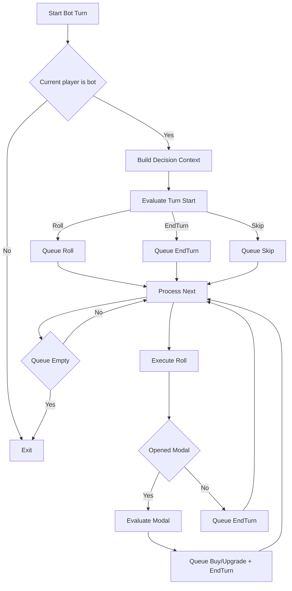
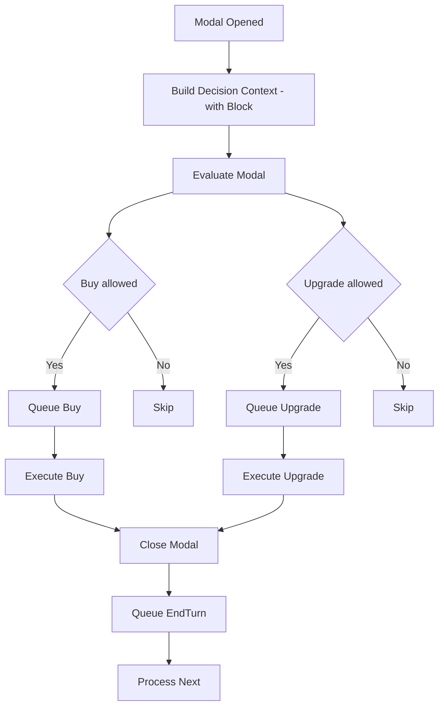
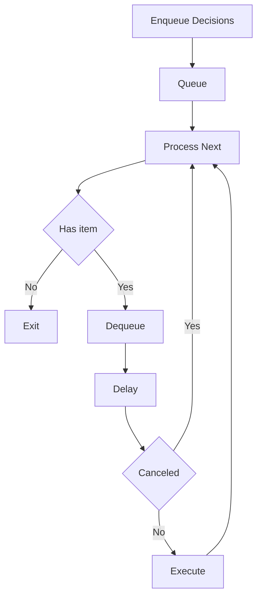
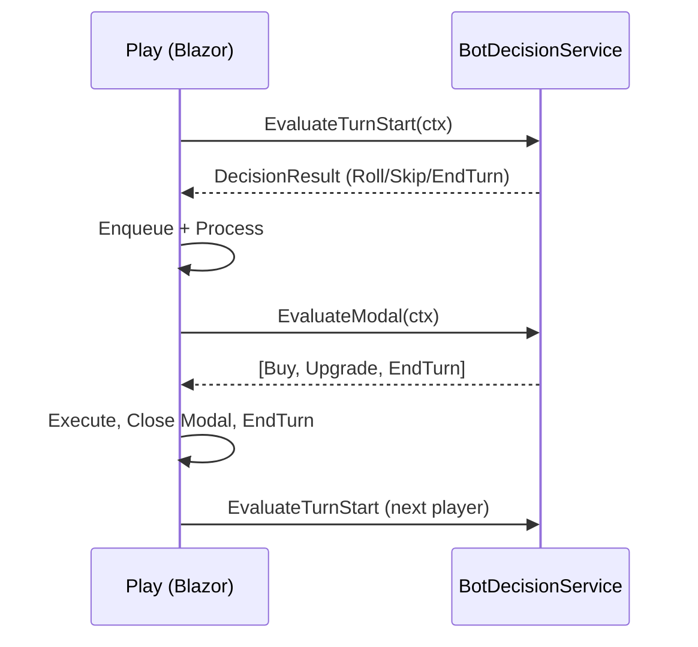
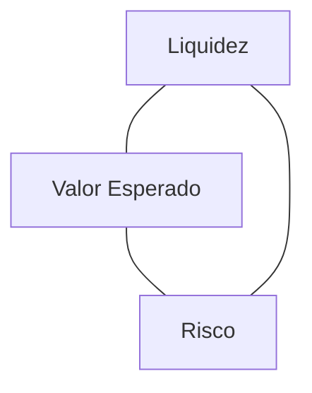
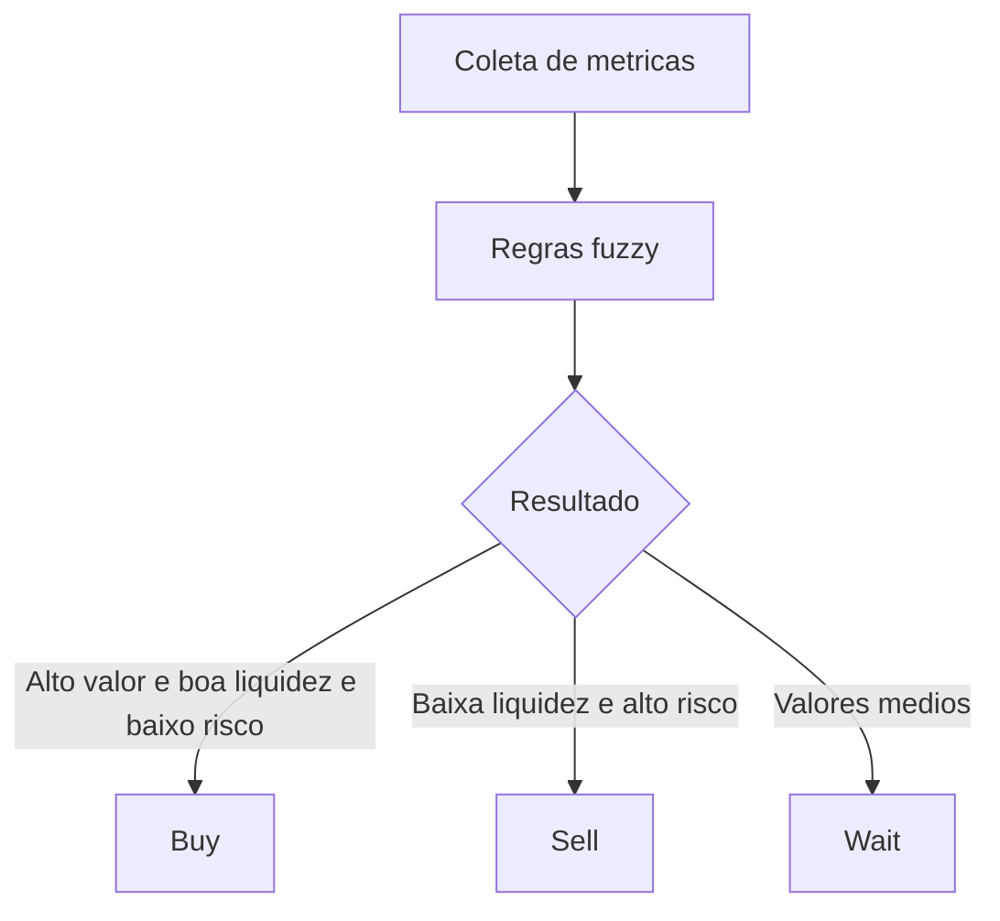
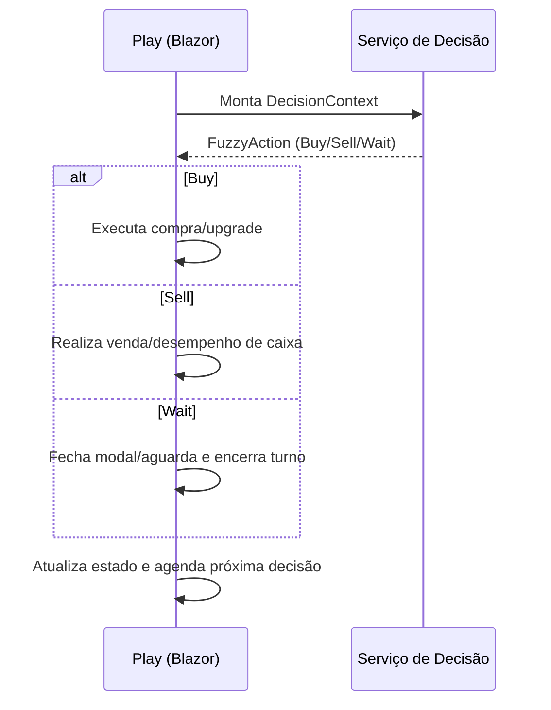

# Modo ASK – Refinamento da Lógica de Decisão do Bot

## 1) Perguntas – Contexto do Projeto
1. Quais outros arquivos além de `BotDecisionService` e `IBotDecisionService` participam diretamente da lógica do bot (ex: handlers em `Play.Bot.cs`, serviços de jogo, componentes Blazor)?
2. O ciclo de turno (início, rolagem de dados, compra, upgrade, fim) está centralizado em uma classe específica? Qual?
3. Há algum mecanismo de injeção de dependência especial ou configuração customizada para o bot no `Program.cs`?

## 2) Perguntas – Objetivo do Bot
4. O que você espera que o bot maximize: lucro, sobrevivência (evitar falência), domínio de grupos de propriedades, rapidez de partida, experiência do usuário? Ordene.
5. O bot deve simular comportamento “humano” (pausas, erros intencionais) ou ser estritamente eficiente?

## 3) Perguntas – Fluxo Atual de Decisões
6. Liste o fluxo completo das decisões do bot em um turno (incluindo condições que interrompem ou repetem ações).
7. Há eventos assíncronos (ex: callback após animação) que podem alterar a ordem das decisões? Quais?
8. Como é disparado o momento de “ShouldAutoRoll”: timer, evento de UI, loop interno ou outro mecanismo?

## 4) Perguntas – Regras de Negócio
9. Existem regras especiais de compra (ex: não comprar se saldo após compra < X, priorizar cores, evitar empresas)? Descreva.
10. Existem limites ou custos dinâmicos de upgrade que variam com estado global (ex: inflação, fases do jogo)?
11. Existem situações em que o bot deve poupar caixa para possíveis multas futuras (ex: probabilidade alta de cair em propriedade cara)?

## 5) Perguntas – Problemas Atuais / Bugs / Limitações
12. Em quais decisões o bot hoje toma ações consideradas ruins ou incoerentes? Dê exemplos concretos.
13. Há race conditions ou decisões duplicadas devido a múltiplos triggers? Onde?
14. O atraso (delays) está atrapalhando UX ou causando overlaps com animações/chat?

## 6) Perguntas – Restrições Técnicas
15. Há necessidade de manter compatibilidade com possíveis versões futuras (ex: IA, heurísticas configuráveis via JSON)?
16. Existem restrições de performance no Blazor (ex: evitar renderizações excessivas, evitar StateHasChanged em loop)?
17. O bot precisa funcionar offline ou reagir a APIs externas (ex: telemetria, estatísticas)?

## 7) Perguntas – Critérios de Sucesso
18. Como será medido que a nova lógica está melhor (tempo médio de jogo, taxa de falência, feedback de usuários)?
19. Qual nível de explicabilidade você precisa (log detalhado por decisão, apenas resumo, nada)?
20. Quais decisões precisam ser facilmente extensíveis (ex: compra, upgrade, risco, negociação futura)?

## Diagnóstico do Algoritmo Atual

### Onde a lógica está hoje
- Serviço central: `BotDecisionService` (heurísticas extremamente simples – basicamente validações de nulidade e tipo + dinheiro suficiente).
- Orquestração de ações e temporizações: espalhada em `Play.Bot.cs` (métodos `TryAutoRollForBotAsync`, `TriggerBotModalIfNeeded`, `BotActOnModalAsync`, `BotAutoActionsIfNeeded`, `TryBotPurchaseAsync`, `TryBotUpgradeAsync`).
- Decisões de turno (rolar dados / avançar turno) misturadas com lógica de UI (ex: animação, modal, chat) dentro do componente Blazor.

### Fluxo real observado
1. Verificação periódica/sequencial para auto-roll via `TryAutoRollForBotAsync` (recursão após avanço de turno).
2. Ao abrir modal de bloco: dispara pensamento (delay), tenta compra, tenta upgrade, fecha modal.
3. Compra: checagem direta com heurística trivial (preço, tipo, disponibilidade).
4. Upgrade: checagem condicional de propriedade + regra externa `CanUpgradeAllowed` + heurística trivial sempre-verdadeira.
5. Turno avança imediatamente se após rolagem não há modal, dentro do próprio componente.

### Dados considerados atualmente
- Flags de UI/estado: `_isTypingChat`, `_isAnimating`, `_modalFromMove`, `_botHasActedThisModal`, `HasRolledThisTurn`.
- Estado mínimo do jogo: índice do jogador atual, lista de jogadores, dinheiro do jogador, tipo/preço/owner do bloco.
- Não utiliza: distribuição de propriedades entre jogadores, probabilidade de cair em certos blocos, potencial de completar conjuntos, fluxo de caixa futuro, risco de liquidez, histórico de decisões.

### Acoplamentos e duplicações
- Duplicação parcial entre `BotActOnModalAsync` e `BotAutoActionsIfNeeded` (sequência compra/upgrade + delays).
- Heurísticas (pure rules) misturadas com efeitos colaterais (enfileirar diálogos, delays, salvar jogo) no componente.
- Delays fixos codificados tanto no serviço quanto repetidos no componente (ex: delay inicial de 650ms antes de `BotActOnModalAsync`).
- Recursão em `TryAutoRollForBotAsync` para continuar jogando em sequência pode gerar complexidade de rastreamento (embora limitada).

### Riscos / Problemas
- Possível race condition: `TriggerBotModalIfNeeded`agenda ação com `InvokeAsync` + delay; antes do início a flag `_botHasActedThisModal` ainda falsa, outro gatilho pode disparar `BotAutoActionsIfNeeded`.
- Falta de cancelamento: todos os `Task.Delay` são não canceláveis; se estado muda (turno avança, modal fecha) ação pode ainda ocorrer tardiamente.
- Nenhuma avaliação de risco financeiro (bot pode torrar recursos em upgrades cedo demais).
- Heurística de upgrade sempre retorna true — não pondera retorno sobre investimento ou completar conjunto.
- Ausência de logs estruturados dificulta depuração e ajuste fino.
- Lógica de avanço de turno acoplada ao componente: difícil migrar para testes unitários isolados.

### Limitações conceituais
- Modelo atual é reativo simplista (evento -> delay -> ação) sem planejamento de múltiplas ações futuras.
- Não existe abstração de "Estratégia" ou "Plano"; cada método decide na hora com base em critérios binários.
- Sem modularidade para trocar heurísticas por simulação (ex: calcular valor esperado de compra vs reservar caixa).

## Paralelo: Atual vs Abordagem Proposta

| Aspecto | Estado Atual | Direção Proposta |
|---------|--------------|------------------|
| Local da decisão | Misturado (serviço + componente) | Centralizar avaliação em serviço/estratégias independentes de UI |
| Profundidade heurística | Binária/simplista | Multi-critérios (valor esperado, risco, sinergia de conjuntos) |
| Sequenciamento | Procedural com delays fixos | Pipeline: Coleta estado -> Avaliação -> Plano -> Execução agendada |
| Extensibilidade | Baixa (hard-coded) | Estratégias plugáveis, registry ou factory para cada tipo de decisão |
| Observabilidade | Diálogos apenas | Logging estruturado + IDs de decisão + métricas |
| Confiabilidade assíncrona | Sem cancelamento | Token de cancelamento / scheduler único de ações do bot |
| Controle de ritmo | Delays fixos em vários pontos | Camada de Timing central (config ou adaptativa) |
| Testabilidade | Difícil (lógica em componente) | Serviço puro testável + simulações de estado |
| Prevenção de duplicidade | Flags manuais | Scheduler + estado de execução atomizado |

## Principais Gaps a Endereçar
- Separar claramente avaliação (heurística) da execução (efeitos colaterais/UI/diálogo).
- Introduzir camada de estado enriquecido (ex: snapshot do tabuleiro + métricas de risco) consumida pelas heurísticas.
- Remover duplicação de sequência compra/upgrade consolidando em um único orquestrador.
- Adicionar salvaguardas financeiras (ex: manter saldo mínimo percentual / estimativa de custos iminentes).
- Implementar mecanismo de cancelamento para ações agendadas quando o contexto muda.
- Adotar estrutura de resultado de decisão (ex: objeto Decision com tipo, motivo, prioridade) em vez de bool solto.
- Criar ponto único de agendamento (scheduler) para evitar triggers simultâneos.
- Incluir logs estruturados por decisão para futura análise e tunning.

## Próximos Passos Conceituais (antes de implementar)
1. Mapear todos os triggers que podem iniciar decisões e consolidar em um orquestrador único.
2. Definir conjunto mínimo de métricas do estado (ex: saldo, renda passiva projetada, ameaças próximas, potencial de completar conjuntos).
3. Especificar formato de um `DecisionContext` e `DecisionResult` (conceitualmente, sem código aqui) para padronizar entrada/saída.
4. Priorizar quais heurísticas avançadas entram primeiro (ex: compra inteligente vs upgrade seletivo).
5. Planejar introdução de logging leve (ex: categoria, ação, justificativa, tempo de decisão) para validação.
6. Catalogar pontos de duplicação e remover (unificar ações de modal em um único método com parâmetros de fase).
7. Definir política de delays (dinâmicos vs fixos) e como serão ajustados por tipo de decisão.
8. Planejar testes unitários simulando cenários chave (risco alto, baixa liquidez, oportunidade de monopólio).

## PASSO 1 – PLANO RÁPIDO
- Criar tipo `DecisionContext` com snapshot: jogador atual, saldo, reserva mínima, propriedades do jogador, grupos/quase-grupos, propriedades adversárias críticas, bloco atual (se houver), custos potenciais próximos, round atual, histórico simples (última ação relevante), flags de UI relevantes (apenas se impactam timing, não decisão econômica).
- Criar enum `DecisionType` (Roll, Buy, Upgrade, EndTurn, Skip, None) e classe `DecisionResult` (DecisionType, TargetBlockId, Reason, Priority, SuggestedDelayMs, IsCancelable).
- Refatorar `BotDecisionService` para expor métodos: `EvaluateTurnStart`, `EvaluateModal`, `EvaluatePostRoll` retornando `DecisionResult` ou lista priorizada.
- Introduzir sub-estratégias (internas ou privadas) para compra e upgrade: cálculo de score (valor esperado renda futura, sinergia do conjunto, custo relativo ao saldo após reserva mínima, risco de cair em blocos caros adversários).
- Ajustar `Play.Bot.cs` para montar `DecisionContext`, chamar serviço, aplicar resultado; remover duplicação de compra/upgrade (um único método `ExecuteModalBotFlowAsync`).
- Implementar simples scheduler: fila de `DecisionResult` pendentes; processa um por vez; cancela em mudanças de turno/modal.
- Centralizar política de delays: usar `SuggestedDelayMs` vindo do serviço; componente só aplica; se contexto mudar antes do delay, descarta.
- Adicionar logging básico (ex: `BotDecisionLogger`) registrando decisão, score, razão.
- Garantir que `TryAutoRollForBotAsync` use nova avaliação em vez de regras locais.

## PASSO 2 – ESPECIFICAÇÃO DA NOVA LÓGICA (PSEUDOCÓDIGO/FLUXO)

### Estruturas Conceituais
DecisionContext:
```
PlayerId
PlayerName
Cash
MinReserve
OwnedProperties
OpponentThreats
UpcomingRiskEstimate
CurrentBlock
BlockPrice / UpgradeCost
RoundNumber
HasRolledThisTurn
ModalIsFromMove
GameIsAnimating / ChatActive
```
DecisionResult:
```
Type (Roll|Buy|Upgrade|EndTurn|Skip|None)
TargetBlockId
Priority (0..100)
Reason
SuggestedDelayMs
IsCancelable
```

## Diagramas (Mermaid)

### Visão geral do fluxo de turno do bot


### Fluxo do modal de propriedade


### Scheduler simplificado


### Interação Componentes vs Serviço


## Resumo do Entendimento (Sem Código)
- Mapear todos os pontos de entrada das decisões (turno, compra, upgrade, rolagem) e centralizar onde fizer sentido.
- Definir objetivos claros (priorização de métricas) para orientar heurísticas mais avançadas (ex: avaliação de risco vs retorno).
- Introduzir camadas ou estratégia: separação entre coleta de estado, avaliação heurística, e execução da ação.
- Adicionar critérios de proteção financeira (limites mínimos de saldo antes de comprar/upgrade) se necessário.
- Garantir que triggers assíncronos (animações, chat, timers) não disparem decisões duplicadas.
- Possível necessidade de logs explicativos leves para depuração e validação de heurísticas.
- Preparar estrutura para futura extensibilidade (ex: registrar heurísticas como serviços ou estratégias por tipo de decisão).
- Revisar delays para equilibrar UX e evitar conflito com animações.
- Focar em clareza e baixa duplicação antes de otimizações de micro-performance.

RESPONDA AS PERGUNTAS ACIMA. DEPOIS USAREMOS O MODO IMPLEMENTAÇÃO.


---

## Nova Lógica Fuzzy de Compra, Venda e Espera

Esta versão introduz uma camada fuzzy para decisões econômicas do bot, consolidada no enum `FuzzyAction` em `UFF.Monopoly/Infrastructure/Bot/Fuzzy/FuzzyAction.cs`. As ações crisp resultantes do processo fuzzy são:
- `Buy`: comprar quando a utilidade esperada e a liquidez permitem.
- `Sell`: vender ativos para recuperar caixa sob risco elevado.
- `Wait`: aguardar quando o equilíbrio risco/retorno não favorece ação imediata.

### Triângulo de Decisões (Liquidez × Valor Esperado × Risco)
O bot avalia três eixos principais e defuzifica para uma ação crisp:
- Liquidez: caixa atual vs. reserva mínima e custos iminentes.
- Valor esperado: renda futura (aluguel), sinergia de conjuntos (monopólio), potencial de upgrade.
- Risco: probabilidade de cair em propriedades caras dos oponentes e multas próximas.

#### Onde isso está no código
- Enum de ação: `UFF.Monopoly/Infrastructure/Bot/Fuzzy/FuzzyAction.cs`.
- Avaliação e orquestração: `Play.Bot.cs` (monta contexto e executa decisões) e serviço de decisão do bot (`BotDecisionService`, quando presente).
- Componentes relacionados: `BlockActionContent.razor` (modal de ações), `Play.Dialogue.cs` (diálogos/UX), `Play.Utils.cs` (utilitários de turno).

### Fluxo Fuzzy Aplicado ao Modal
1) Coletar contexto (saldo, bloco atual, propriedade/grupo, risco próximo).
2) Calcular scores: Liquidez, Valor Esperado, Risco.
3) Defuzificar em `FuzzyAction`: `Buy`, `Sell` ou `Wait`.
4) Executar ação no pipeline do componente (compra/upgrade/fechamento de modal/encerrar turno).

### Impactos e Modificações
- Centralização conceitual das decisões: serviço retorna tipo de ação e o componente Blazor agenda execução (evita duplicidade de triggers).
- Salvaguardas de caixa: reserva mínima antes de `Buy` e preferência por `Sell` sob risco alto.
- Extensibilidade: novas heurísticas podem ajustar os pesos dos eixos sem alterar UI.
- Observabilidade: decisões podem ser logadas com razão e prioridade.

### Diagrama: Triângulo Fuzzy de Decisão


### Diagrama: Defuzificação para `FuzzyAction`


### Diagrama: Integração com o Pipeline do Bot (Blazor)


### Resumo para apresentação
- `FuzzyAction` adiciona uma política econômica dinâmica (comprar, vender, esperar) com base em três métricas.
- O componente `Play.Bot.cs` consome essa decisão e evita race conditions via fila/atrasos sugeridos.
- O triângulo de decisões melhora a coerência: protege liquidez, aproveita oportunidades de monopólio e reduz risco.
- Arquivos principais: `Infrastructure/Bot/Fuzzy/FuzzyAction.cs`, `Components/Pages/GamePlay/Play.Bot.cs`, `BlockActionContent.razor`, `Play.Dialogue.cs`, `Play.Utils.cs`.
